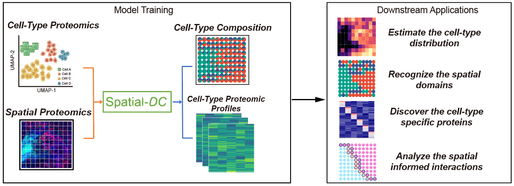

## Spatial-DC

To enhance the utility of spatial proteomics data, we propose Spatial-DC (Spatial Digital Cytometry), a deep learning-based framework that infers cell-type composition in each spot and reconstructs spatially and cell-type resolved proteomic profiles. We achieve this by utilizing transfer learning and self-supervised learning with graph convolutional networks (GCN), which enables the incorporation of target spatial proteomics with reference single-cell or single-cell-type proteomics data.

### Example Analysis with Spatial-DC: [here](https://liyuan-bioinfo.github.io/Spatial-DC/documentation/04_Spatial-DC_Example.html).
